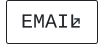
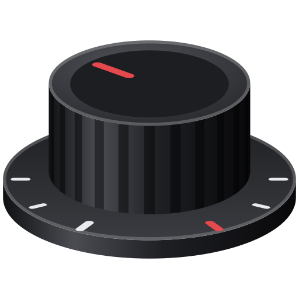
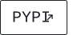
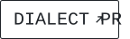
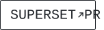
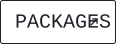
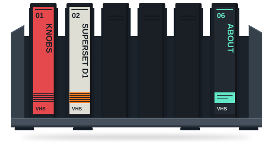

<!--
THESIS: The profile is the front panel of the AV–01 deck from Daniel's site, Midnight Studio, standing by with no tape loaded. It refuses the wave banner, typing line, badges and stats cards of the profile template.
OWN-WORLD: Matte graphite hardware (#35404b fascia, #151d27 recesses, beveled #46515d caps), silkscreen Archivo 600/800 caps, nothing glowing; a red sound slash is the deck's one colour print. Saturated colour lives only on cassette labels on the shelf, as label data: red KNOBS, orange SUPERSET D1, mint ABOUT. Links are the tube's on-screen links: VT323 in a 1px outline, in the page's ink.
STORY: A visitor meets a deck bearing Daniel's name, standing by, with the links to reach him beneath it; reads who he is, the projects and what he uses, and leaves past the tape shelf to the site.
FIRST VIEWPORT: Full-width deck on its table: name and SOUND key at left, the slot's flap closed in the centre, STANDBY window and eject at right. LinkedIn, Email and alyoshin.dev OSD links centred beneath.
FORM: The Deck, grounded structure 5 of 7, no staging; seed 61f2635d.
-->

<picture>
  <source media="(max-width: 1011px)" srcset="assets/deck-compact.svg" />
  
</picture>

<a href="https://www.linkedin.com/in/danielalyoshin/"><picture><source media="(prefers-color-scheme: dark)" srcset="assets/link-linkedin-dark.svg" /></picture></a>
<a href="mailto:daniel.alyoshin@mail.utoronto.ca"><picture><source media="(prefers-color-scheme: dark)" srcset="assets/link-email-dark.svg" /></picture></a>
<a href="https://alyoshin.dev"><picture><source media="(prefers-color-scheme: dark)" srcset="assets/link-site-dark.svg" /></picture></a>

<h3><picture><source media="(prefers-color-scheme: dark)" srcset="assets/label-about-dark.svg" /></picture></h3>

I'm in my final year at the University of Toronto, in the Computer Science Specialist program with a focus on software engineering.

My skills are split between software architecture and sales, so I'm as comfortable planning how a system fits together as I am talking a client through what it will do for them. I've worked across entertainment and health tech, and several of my projects are in active use.

<h3><picture><source media="(prefers-color-scheme: dark)" srcset="assets/label-projects-dark.svg" /></picture></h3>

**knobs** 
C++ · libobs · OBS Studio · Windows

 

A Windows app I built that gives every app on your PC the mic sound you set up in OBS Studio. It uses OBS's own audio code and reads your settings from OBS, so your mic sounds exactly as it does there, bit for bit. knobs is an independent project, not affiliated with or endorsed by the OBS Project.

<a href="https://getknobs.app"><picture><source media="(prefers-color-scheme: dark)" srcset="assets/link-getknobs-dark.svg" /></picture></a>
<a href="https://github.com/danielalyoshin/knobs"><picture><source media="(prefers-color-scheme: dark)" srcset="assets/link-knobs-source-dark.svg" /></picture></a>

**Cloudflare D1 in Apache Superset** 
Python · SQLAlchemy · Cloudflare D1 · Apache Superset

 

In 2025 I was one of the people who built the packages that first connected Apache Superset, the open-source data visualization platform, to Cloudflare D1, a serverless SQLite database. Today I'm their primary maintainer.

<a href="https://pypi.org/project/sqlalchemy-d1/"><picture><source media="(prefers-color-scheme: dark)" srcset="assets/link-pypi-dark.svg" /></picture></a>
<a href="https://github.com/sqlalchemy-cf-d1/sqlalchemy-d1/pull/1"><picture><source media="(prefers-color-scheme: dark)" srcset="assets/link-dialect-pr-dark.svg" /></picture></a>
<a href="https://github.com/apache/superset/pull/44505"><picture><source media="(prefers-color-scheme: dark)" srcset="assets/link-superset-pr-dark.svg" /></picture></a>
<a href="https://github.com/sqlalchemy-cf-d1"><picture><source media="(prefers-color-scheme: dark)" srcset="assets/link-packages-dark.svg" /></picture></a>

<h3><picture><source media="(prefers-color-scheme: dark)" srcset="assets/label-stack-dark.svg" /></picture></h3>

Python · C/C++ · Kotlin/Java · TypeScript · LLMs and AI · Docker · Kubernetes · Cloud · Databases

   
  The full studio: <a href="https://alyoshin.dev">alyoshin.dev</a>

